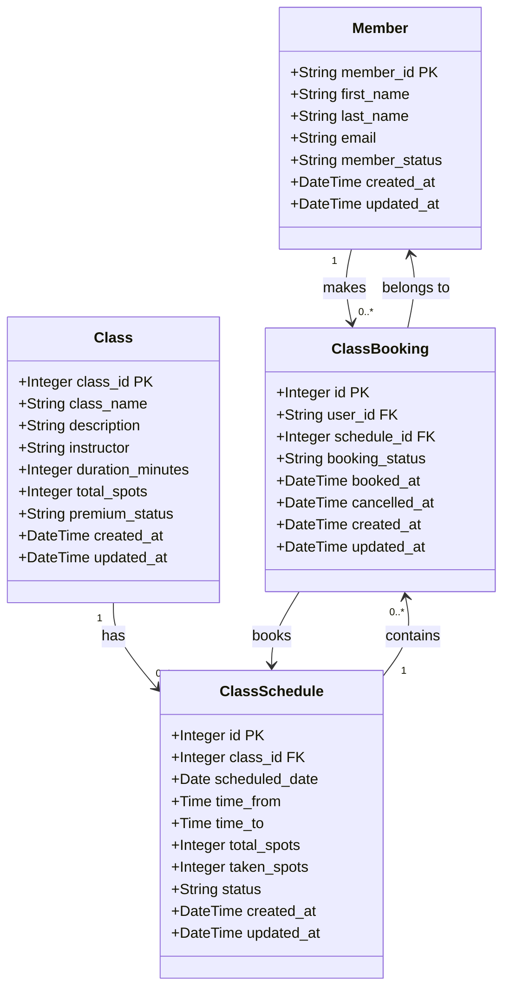

# Class Diagram - FitHub Class Booking System

This diagram represents the database schema and relationships for the FitHub Class Booking System.

## Key Relationships

- **Member to ClassBooking**: One member can make many bookings (1:N)
- **Class to ClassSchedule**: One class template can have many scheduled instances (1:N)
- **ClassSchedule to ClassBooking**: One schedule can have many bookings (1:N)

## Important Columns

- **member_status**: Determines tier level (basic, premium, vip)
- **premium_status**: Defines class access requirement (basic, premium, vip)
- **taken_spots**: Current number of bookings for a schedule
- **total_spots**: Maximum capacity for a class/schedule
- **booking_status**: Current state of booking (confirmed, cancelled)
