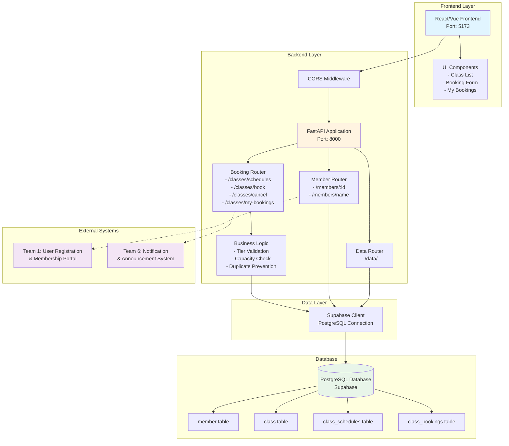

# Component Diagram - FitHub Class Booking System

This diagram shows the major software components and their interactions in the FitHub Class Booking System.

## Component Descriptions

### Frontend Layer
- **React/Vue Frontend**: Single-page application providing the user interface
- **UI Components**: Reusable components for class listing, booking, and management

### Backend Layer
- **FastAPI Application**: Main REST API server handling all business logic
- **Booking Router**: Handles class booking, cancellation, and schedule retrieval
- **Member Router**: Manages member information retrieval
- **Data Router**: Generic data endpoints for testing
- **CORS Middleware**: Enables cross-origin requests from frontend
- **Business Logic**: Validates membership tiers, checks capacity, prevents duplicates

### Data Layer
- **Supabase Client**: Python client for interacting with PostgreSQL database

### Database
- **PostgreSQL Database**: Hosted on Supabase, stores all application data
- **member table**: User membership information and status
- **class table**: Class templates and definitions
- **class_schedules table**: Scheduled class instances
- **class_bookings table**: Individual booking records

### External Systems
- **Team 1**: Provides membership tier information
- **Team 6**: Receives booking confirmations for notifications
