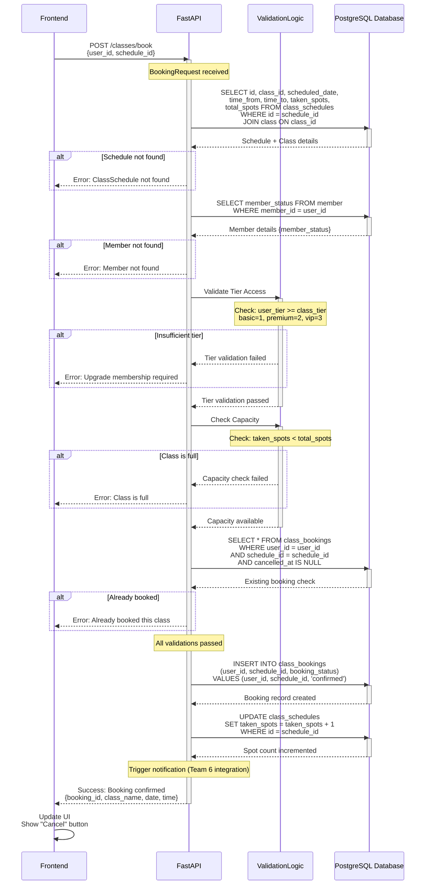

# Sequence Diagram - Book Class Flow

This diagram models the successful transaction flow for booking a class in the FitHub system.

## Flow Description

### Step-by-Step Process

1. **Request Initiation**: Frontend sends POST request with user_id and schedule_id
2. **Fetch Schedule**: Retrieve class schedule and associated class details from database
3. **Fetch Member Status**: Query member table to get user's membership tier
4. **Tier Validation**: Compare user's membership tier against class premium requirement
   - Hierarchy: basic (1) < premium (2) < vip (3)
   - User tier must be >= class tier requirement
5. **Capacity Check**: Verify that taken_spots < total_spots
6. **Duplicate Prevention**: Check if user already has an active booking for this schedule
7. **Create Booking**: Insert new booking record with confirmed status
8. **Increment Spot Count**: Update class_schedules.taken_spots by 1
9. **Return Success**: Send confirmation back to frontend with booking details

### Error Handling

The sequence includes multiple validation checkpoints:
- Schedule existence check
- Member existence check
- Tier access validation
- Capacity availability check
- Duplicate booking prevention

Each validation failure returns an appropriate error message to the frontend.

### Integration Points

- **Team 6 Notification System**: After successful booking, a notification event is triggered (currently mocked)
- **Team 1 Membership Portal**: Member status data originates from Team 1's system
