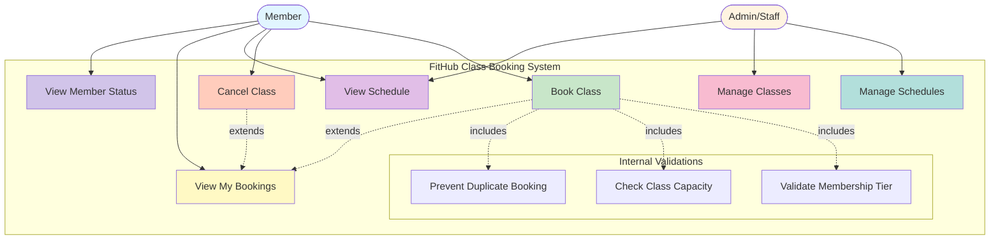

# Use Case Diagram - FitHub Class Booking System

This diagram illustrates the actors and use cases in the FitHub Class Booking System.

## Actor Descriptions

### Member
Regular users of the FitHub system who can:
- **Book Class**: Reserve a spot in an available class
- **Cancel Class**: Cancel their existing booking
- **View Schedule**: Browse available classes by date
- **View My Bookings**: See their upcoming confirmed bookings
- **View Member Status**: Check their membership tier and benefits

### Admin/Staff
Administrative users who can:
- **Manage Schedules**: Create, update, or delete class schedules
- **Manage Classes**: Add, modify, or remove class templates
- **View Schedule**: Monitor class availability and bookings

## Use Case Descriptions

### Primary Use Cases

1. **Book Class**
   - **Actor**: Member
   - **Description**: Member selects a class from the schedule and creates a booking
   - **Includes**: 
     - Validate Membership Tier (check if member can access premium classes)
     - Check Class Capacity (ensure spots are available)
     - Prevent Duplicate Booking (verify member hasn't already booked)
   - **Extends**: View My Bookings (after successful booking)

2. **Cancel Class**
   - **Actor**: Member
   - **Description**: Member cancels their existing booking, freeing up a spot
   - **Extends**: View My Bookings (updates booking list)

3. **View Schedule**
   - **Actor**: Member, Admin/Staff
   - **Description**: Browse available classes filtered by date, showing capacity and details

4. **View My Bookings**
   - **Actor**: Member
   - **Description**: Display all confirmed bookings for the logged-in member

5. **Manage Schedules**
   - **Actor**: Admin/Staff
   - **Description**: Create, update, or delete specific class schedule instances

6. **Manage Classes**
   - **Actor**: Admin/Staff
   - **Description**: Add, modify, or remove class templates

7. **View Member Status**
   - **Actor**: Member
   - **Description**: Check membership tier level and associated privileges

### Internal Validation Use Cases

- **Validate Membership Tier**: Ensures member has appropriate tier for class
- **Check Class Capacity**: Verifies available spots before booking
- **Prevent Duplicate Booking**: Prevents member from booking same class twice
